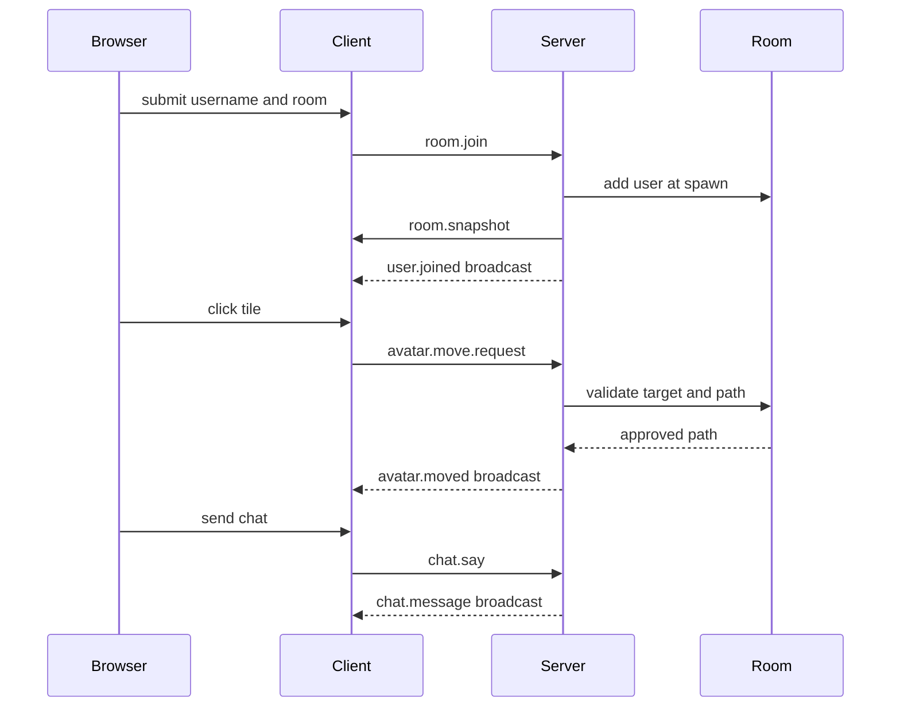

# Architecture

The repository is a Bun workspace monorepo.

```txt
apps/
  client/
  server/
packages/
  engine/
  protocol/
assets/
  rooms/
docs/
```

## Packages

### `apps/client`

Owns browser rendering, input, and local UI.

Responsibilities:

- Serve `index.html` through Bun's HTML dev server.
- Connect to the WebSocket server.
- Send client intent messages.
- Maintain a projected local room scene from server messages.
- Render the isometric tile grid with PixiJS.
- Render placeholder avatars and username labels.
- Animate movement along server-approved paths.
- Render login and chat UI with safe DOM APIs.

The client is not authoritative. It requests movement, but never directly sets accepted avatar position.

### `apps/server`

Owns the realtime authority.

Responsibilities:

- Accept WebSocket connections with `Bun.serve`.
- Assign temporary user IDs.
- Validate every inbound client message.
- Manage in-memory room instances.
- Join and leave users.
- Calculate and validate movement paths.
- Broadcast room snapshots, joins, leaves, movement, and chat.
- Load or seed durable room layout data when `DATABASE_URL` is configured.
- Upsert joined users without persisting transient movement or chat history.

### `packages/protocol`

Owns the JSON network contract.

Responsibilities:

- Define client-to-server message types.
- Define server-to-client message types.
- Define runtime schemas with Zod.
- Parse raw WebSocket payloads safely.
- Enforce size and payload limits.

This package must not import client or server code.

### `packages/engine`

Owns deterministic game logic that can run on both client and server.

Responsibilities:

- Tile and room layout types.
- Isometric coordinate conversion.
- Grid walkability.
- A* tile pathfinding with cardinal and diagonal movement.

This package must stay free of browser and server runtime dependencies.

## Runtime Flow



## State Boundaries

Server-owned:

- Connected socket identity.
- Current joined room.
- Authoritative avatar tile.
- Accepted movement path.
- Room membership.
- Chat broadcast payloads.

Client-owned:

- Canvas rendering.
- Pointer-to-tile conversion.
- Local interpolation along accepted paths.
- Login form state.
- Chat input state.

Shared:

- Protocol types.
- Protocol validation limits.
- Tile/grid/pathfinding/projection helpers.
